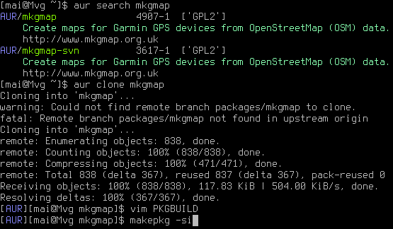

## aur.bash

this is a super minimal aur helper that can search, clone, and throw you in a subshell to build a package

it also supports retrieving PKGBUILDS that are in the main arch repos

#### Setup / Usage

 
 1. `$ mkdir -p ~/work/aur && cd ~/work/aur && git clone https://github.com/mai-gh/aur-helper.git`
 2. aur.bash can be sourced, aliased, or ran directly, any of the following will work
   - `$ bash ~/work/aur/aur-helper/aur.bash`
   - `$ echo "source ~/work/aur/aur-helper/aur.bash" >> ~/.bashrc`
   - `$ echo "alias aur='~/work/aur/aur-helper/aur.bash' >> ~/.bashrc`  
 3. run `aur sync` to download a list of all the aur packages
 4. run `aur search $SEARCH_TERM` to find a package 
 5. run `aur clone $PKG_NAME` to clone a repo, and spawn a subshell
 6. review / edit the PKGBUILD, then build+install with `makepkg -si`
 7. press `Ctrl + d` to exit the subshell and return to where you started from
